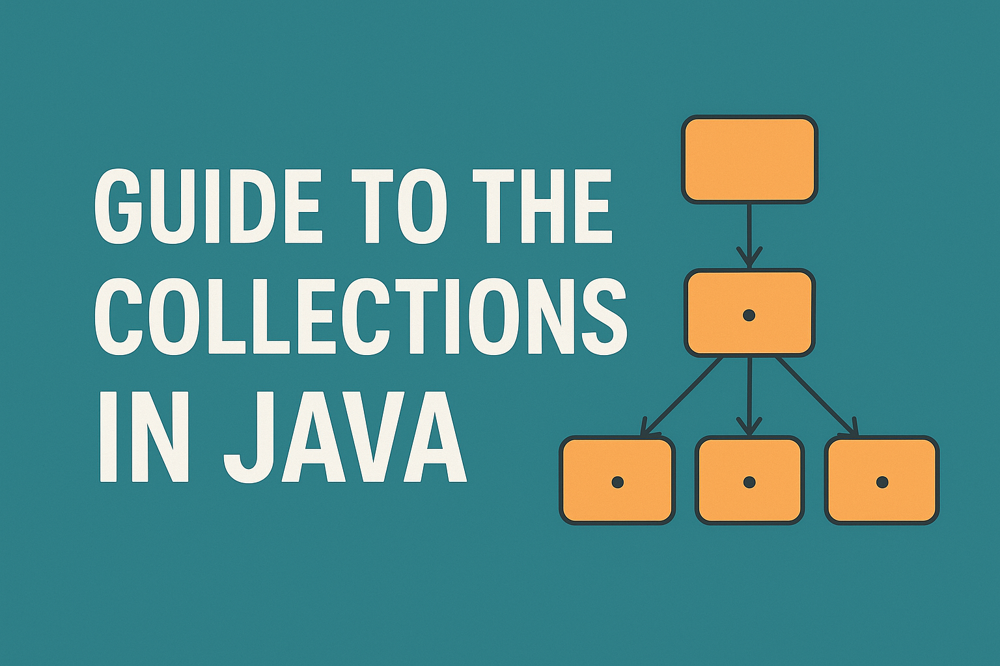

<a href="https://hashnode.com/6889c0cdd38ceb75f02e1db1/dashboard/posts">
  <h1 align="center">Blogs Archive</h1>
</a>

  Showcase of my journey to building a solid Foundation in Java.

&nbsp;&nbsp;

 
### [How to Use the Java Collections Framework – A Guide for Developers](https://data-structur-and-algorithmjava.hashnode.dev/how-to-use-the-java-collections-framework-a-guide-for-developers)

  <a href="https://data-structur-and-algorithmjava.hashnode.dev/how-to-use-the-java-collections-framework-a-guide-for-developers">
      

      
    

  </a>
 

## Contributing..
Contributions are always welcome!   

See [CONTRIBUTING.md](../CONTRIBUTING.md) for ways to get started.
  
